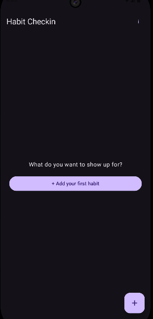
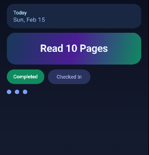

# One-Tap Habit Tracker (Android)

A calm, minimalist habit tracker focused on **showing up**, not streaks.

This app is built around a simple idea:

> **No guilt. No streak pressure. Just one tap a day.**

---

## ✨ Philosophy

Most habit apps fail because they turn consistency into pressure.

This app deliberately avoids:
- ❌ streaks
- ❌ broken chains
- ❌ missed-day warnings
- ❌ overwhelming dashboards

Instead, it focuses on:
- ✅ one habit at a time
- ✅ one tap per day
- ✅ neutral, rolling progress
- ✅ calm, forgiving UX

The goal is to make opening the app feel safe — even after missing days.

---

## 📱 Core UX Principles

- **One habit per screen**  
  Focus on a single habit at a time.

- **Swipe to switch habits**  
  No lists, no clutter, no decisions.

- **Rolling 7-day progress**  
  Shows recent effort without calendar judgment.

- **Completion is date-based**  
  A habit is “done” for a specific day — no toggles, no resets.

---

## 🧠 How It Works

- Each habit is stored locally on the device
- Each completion is saved as a daily log
- Progress is derived from history, not counters
- Missing days are treated as neutral — not failure

The app works fully offline and stores all data locally.

---

## 🧪 MVP Feature Set

- Create habits
- Swipe horizontally between habits
- One-tap daily check-in
- Persistent habit history
- Rolling 7-day progress dots
- Calm empty state
- No accounts, no analytics, no network calls

---

## 🛠 Tech Stack

- **Language:** Kotlin
- **UI:** Jetpack Compose (Material 3)
- **Architecture:** Single-Activity, ViewModel-driven
- **Persistence:** Room (local database)
- **Target Platform:** Android (Play Store)

---

## 📸 Screenshots

### Empty State

### Habit Screen

### Progress View

### Swipe Navigation

---

## 🚀 Why This Project

This project was built as an exercise in:
- product thinking over feature count
- correct data modeling before UI polish
- calm UX in a space dominated by pressure-driven design

It is intentionally small, focused, and opinionated.

---

## 📌 Future Ideas (Post-MVP)

- Subtle haptics & micro-animations
- Optional reminders
- Export/share progress
- Theming & personalization
- iOS version (possible)

---

## 📄 License

MIT

👉 [Download v1.0.0-beta APK](https://github.com/Smit-Bharshankar/HabitCheck-in/releases/download/v1.0.0-beta/Habit.Checkin.apk)
